<p align="center">
  
</p>

# MASK.EXE

<p align="center">
  <a href="https://github.com/Brightlyviryaa/MASKS.exe"></a>
  <a href="https://github.com/Brightlyviryaa/MASKS.exe/blob/main/LICENSE"></a>
  
  
</p>

---

## Deskripsi Game

**MASK.EXE** adalah visual novel psikologis berdurasi pendek yang dibuat untuk Global Game Jam 2026 dengan tema **“Mask”**. Pemain terbangun di sebuah teater kosong dan dihadapkan pada beberapa topeng. Setiap topeng membawa pemain ke dunia emosi yang berbeda—kebahagiaan, kemarahan, kesedihan, kebenaran, dan keheningan—yang perlahan mengungkap bahwa topeng bukan sekadar benda, tetapi representasi dari identitas dan peran yang kita pakai dalam hidup.

Game ini menekankan suasana surreal, sunyi, dan meta, seperti pertunjukan yang berjalan tanpa penonton.

---

## Cara Bermain

* Pemain memulai di **Hub Teater**, tempat semua topeng tersedia sebagai pilihan.
* Klik salah satu topeng untuk masuk ke dunia terkait.
* Di setiap dunia, pemain membaca narasi singkat dan memilih beberapa opsi dialog/interaksi.
* Pilihan tidak berfokus pada “benar atau salah”, tetapi pada bagaimana pemain resposn emosi tersebut.
* Beberapa pilihan dan easter egg akan membuka jalur rahasia menuju topeng terakhir.

**Kontrol sederhana:**

* Klik untuk lanjut dialog
* Pilih opsi tombol untuk menentukan respon
---

## Tujuan Permainan

Tujuan utama pemain adalah:

* Mengeksplorasi semua dunia topeng
* Mengumpulkan petunjuk untuk membuka **Mask of Hunger**, topeng terakhir yang tersembunyi
* Mengambil keputusan final yang menentukan ending permainan

---

## Game Flowchart

```mermaid
flowchart TD
    subgraph START["🎭 OPENING"]
        Boot["Boot Scene<br/>Theater Introduction"]
    end

    subgraph HUB["🎪 THEATER HUB"]
        Hub["Choose Your Mask"]
    end

    subgraph MASKS["🎭 MASK WORLDS"]
        Joy["😊 Joy World<br/><i>False Happiness</i>"]
        Rage["😠 Rage World<br/><i>Arena of Applause</i>"]
        Sorrow["😢 Sorrow World<br/><i>Room Without Faces</i>"]
        Truth["👁️ Truth World<br/><i>The Script</i>"]
        Silence["🤫 Silence World<br/><i>Beyond Words</i>"]
    end

    subgraph HUNGER["🔥 TRUE ROUTE"]
        Hunger["💀 Mask of Hunger<br/><i>The Core Desire</i>"]
    end

    subgraph CHOICES["⚖️ FINAL CHOICE"]
        Wear["👤 Wear the Mask"]
        Destroy["💥 Destroy the Mask"]
        Give["🎁 Give Away<br/><i>Requires: Truth + Silence</i>"]
    end

    subgraph ENDINGS["🏁 ENDINGS"]
        A1["A1: Eternal Smile<br/><i>Joy + Wear</i>"]
        A2["A2: Arena Loop<br/><i>Rage + Wear</i>"]
        A_gen["A_generic: Stay Masked<br/><i>Other + Wear</i>"]
        B1["B1: Forgotten Name<br/><i>Sorrow + Destroy</i>"]
        B2["B2: Script Breaker<br/><i>Truth + Destroy</i>"]
        B_gen["B_generic: Unmasked<br/><i>Other + Destroy</i>"]
        C["C: True Release<br/><i>Give Away</i>"]
        T0["T0: Script Deletion<br/><i>Delete mask in Truth</i>"]
    end

    Boot --> Hub
    Hub --> Joy & Rage & Sorrow & Truth & Silence
    
    Joy & Rage & Sorrow --> Hub
    Truth --> Hub
    Truth -.->|"Delete Mask Variable"| T0
    Silence --> Hub

    Hub -->|"Unlock: Truth + Silence + 2 Main"| Hunger

    Hunger --> Wear & Destroy & Give

    Wear -->|"last_mask = joy"| A1
    Wear -->|"last_mask = rage"| A2
    Wear -->|"other"| A_gen

    Destroy -->|"last_mask = sorrow"| B1
    Destroy -->|"last_mask = truth"| B2
    Destroy -->|"other"| B_gen

    Give --> C

    A1 & A2 & A_gen & B1 & B2 & B_gen & C & T0 --> Credits["🎬 Credits"]
    Credits -->|"Play Again"| Boot

    style T0 fill:#ff6b6b,color:#fff
    style C fill:#4ecdc4,color:#fff
    style Hunger fill:#9b59b6,color:#fff
    style Credits fill:#2c3e50,color:#fff
```



---

## Ending Table

| ID | Nama | Kondisi |
|----|------|---------|
| A1 | Eternal Smile | Joy → Wear Mask |
| A2 | Arena Loop | Rage → Wear Mask |
| A_generic | Stay Masked | Other → Wear Mask |
| B1 | Forgotten Name | Sorrow → Destroy Mask |
| B2 | Script Breaker | Truth → Destroy Mask |
| B_generic | Unmasked | Other → Destroy Mask |
| C | True Release | Truth + Silence → Give Away |
| T0 | Script Deletion | Delete mask variable in Truth World |

---

## Makna di Balik Permainan

MASK.EXE adalah refleksi tentang bagaimana manusia hidup dengan “topeng” setiap hari.
Topeng dalam game bukan hanya benda fisik, tetapi simbol dari:

* Peran sosial yang kita tampilkan
* Emosi yang kita sembunyikan atau paksakan
* Identitas yang terbentuk dari ekspektasi orang lain
* Ketakutan bahwa tanpa topeng, kita mungkin tidak tahu siapa diri kita

**Setiap dunia menunjukkan bahwa emosi bisa menjadi topeng:**

* **Joy** adalah kebahagiaan yang dipaksakan
* **Rage** adalah kemarahan yang dipertontonkan
* **Sorrow** adalah memori yang hilang
* **Truth** adalah kesadaran bahwa semua sudah tertulis
* **Silence** adalah ruang kosong tanpa kata
* **Hunger** adalah inti terdalam: kebutuhan untuk menjadi sesuatu

Pada akhirnya, game bertanya:

> Apakah topeng melindungimu… atau memakanmu?

---

## Inspirasi

MASK.EXE terinspirasi dari beberapa konsep dan karya:

* Teater sebagai simbol kehidupan sosial manusia
* Psychological visual novels seperti *DDLC* dan *The Stanley Parable* dalam pendekatan meta
* Filosofi bahwa identitas sering kali adalah konstruksi peran
* Tema “mask” sebagai metafora universal: senyum palsu, amarah, trauma, dan pencarian diri

Game ini dibuat dengan gaya minimalis namun atmosferik, menekankan pengalaman emosional dan interpretasi pemain.

---

## Cara Menjalankan

1. Buka file `index.html` di browser
2. Atau jalankan dengan server lokal:
   ```bash
   npx http-server -p 8080
   ```

## State Management

Game menggunakan global `window.GameState` untuk tracking flags:
- `joy_eg` - Easter egg di Joy world
- `rage_refused` - Menolak bertarung di Rage world
- `name_lost` - Kehilangan nama di Sorrow world
- `hunger_unlocked` - Unlock Hunger route

## Easter Eggs

- Diam 10 detik di Joy world
- Diam 30 detik di Hub (Banana Ending)
- Input KENNEY di Dev Room
- Delete mask variable di Truth world (Glitch Ending)

---

# MASK.EXE — Scene Meaning Documentation

**Theme: Mask**  
**Genre: Psychological Visual Novel / Meta Theater**

Game ini dibangun seperti pertunjukan emosi manusia. Setiap scene bukan sekadar “level”, tetapi simbol dari topeng yang kita pakai untuk bertahan hidup.

---

## 1. HUB — Empty Theater (The Stage of Identity)

### Deskripsi
Pemain terbangun di panggung teater kosong. Tidak ada penonton, tidak ada aktor, hanya spotlight dan topeng-topeng yang menunggu dipilih.

### Makna
Teater adalah metafora kehidupan sosial:
* Manusia hidup seperti aktor
* Identitas sering kali adalah peran
* Kita selalu “ditonton”, bahkan ketika tidak ada siapa-siapa

Topeng di hub melambangkan pilihan emosi yang akan dipakai untuk menghadapi dunia.

**Pesan:**
> Sebelum kita menjadi diri sendiri, kita memilih peran terlebih dahulu.

---

## 2. Joy World — False Happiness (The Smile as a Mask)

### Deskripsi
Dunia pesta ulang tahun pastel yang terlihat ceria, tetapi terlalu sempurna dan membeku. Tawa terasa dipaksakan.

### Makna
Joy bukan kebahagiaan sejati, tetapi “topeng senyum”:
* Senyum sosial
* Kebahagiaan yang dipertontonkan
* Denial terhadap rasa kosong

Pilihan “Remove your mask” memperlihatkan bahwa bahkan kebahagiaan bisa menekan manusia untuk tetap berpura-pura.

**Pesan:**
> Kadang kita tersenyum bukan karena bahagia, tapi karena harus.

---

## 3. Rage World — Arena of Applause (Anger as Performance)

### Deskripsi
Pemain berada di arena gladiator, dikelilingi sorakan tanpa wajah. Kemarahan terasa seperti hiburan.

### Makna
Rage melambangkan kemarahan yang dipakai sebagai:
* Kekuatan
* Pelindung diri
* Pertunjukan bagi orang lain

Pilihan “Refuse to fight” adalah momen penting: menolak marah berarti menolak menjadi konsumsi penonton.

**Pesan:**
> Kemarahan sering kali bukan untuk kita… tapi untuk dunia yang menonton.

---

## 4. Sorrow World — Room Without Faces (Loss and Memory)

### Deskripsi
Kamar masa kecil yang sunyi. Foto keluarga ada, tetapi wajahnya kosong.

### Makna
Sorrow adalah topeng trauma dan kehilangan:
* Nostalgia yang rusak
* Memori yang tidak lengkap
* Identitas yang mulai hilang

Pilihan “Say your own name” menekankan bahwa kesedihan dapat menghapus diri kita.

**Pesan:**
> Ada luka yang tidak membuat kita menangis… tapi membuat kita lupa siapa kita.

---

## 5. Truth World — The Script Behind the Mask (Meta Awareness)

### Deskripsi
Dunia berubah menjadi void digital. Pemain melihat “kode” di balik cerita.

### Makna
Truth adalah kesadaran bahwa:
* Hidup kadang terasa sudah tertulis
* Pilihan terasa bebas, tapi dibatasi struktur
* Topeng bukan hanya emosi, tapi sistem

Truth menjadi kunci untuk membuka Hunger karena tanpa kesadaran, pemain hanya akan terjebak dalam loop emosi.

**Pesan:**
> Topeng paling menakutkan adalah saat kita sadar semuanya adalah peran.

---

## 6. Silence World — The Room With No Words (Meaning Beyond Language)

### Deskripsi
Ruang kosong abstrak. Tidak ada dialog panjang, hanya simbol geometris.

### Makna
Silence adalah titik setelah semua emosi runtuh:
* Tidak ada tawa
* Tidak ada marah
* Tidak ada tangis
* Bahkan kebenaran pun tidak bersuara

Simbol adalah komunikasi paling dasar, menandakan bahwa pencarian makna terus berjalan bahkan tanpa kata. Silence membuka Hunger karena hanya dalam kekosongan manusia bertemu kebutuhan terdalam.

**Pesan:**
> Saat semua topeng jatuh, yang tersisa adalah sunyi… dan keinginan.

---

## 7. Hunger True Route — The Mask Beneath All Masks (Core Desire)

### Deskripsi
Teater kembali, tapi lebih gelap. Penonton hilang, hanya void. Topeng terakhir menunggu.

### Makna
Hunger bukan emosi seperti lainnya. Hunger adalah inti:
* Kebutuhan untuk menjadi sesuatu
* Keinginan untuk diakui
* Dorongan untuk terus memakai topeng

Hunger adalah alasan semua topeng lain ada.

**Pesan:**
> Kita memakai topeng bukan karena ingin berbohong… tapi karena lapar akan makna.

---

## 8. Ending A — Stay Masked (Comfort Prison)

### Makna
Pemain memilih tetap memakai topeng. Ini melambangkan:
* Hidup nyaman dalam peran
* Identitas yang dibentuk sepenuhnya oleh topeng
* Tidak pernah benar-benar lepas

> Kebahagiaan palsu lebih mudah daripada kebenaran kosong.

---

## 9. Ending B — Unmasked (Emptiness)

### Makna
Pemain menghancurkan topeng, tapi menemukan kehampaan. Ini melambangkan:
* Ketakutan bahwa tanpa peran, kita tidak tahu siapa diri kita
* Kebebasan yang juga menyakitkan

> Topeng hilang, tapi wajah pun tidak ada.

---

## 10. Ending C — Give Away (True Release)

### Makna
Pemain tidak memakai atau menghancurkan, tetapi melepaskan. Ini adalah ending terbaik karena:
* Topeng diakui sebagai pilihan, bukan penjara
* Identitas bukan topeng, tapi kesadaran atas topeng itu sendiri

> Untuk bebas, bukan topeng yang harus hilang… tapi keterikatan padanya.

---

## 11. Credits — Curtain Call (The Play Never Ends)

### Deskripsi
Tirai menutup. Pertunjukan selesai.

### Makna
Credits adalah simbol bahwa:
* Semua ini adalah pertunjukan emosi
* Pemain adalah penonton sekaligus aktor

Easter egg replay menunjukkan loop:
> Teater mengingatmu, seperti hidup mengingat peran yang pernah kamu mainkan.

---

## Kesimpulan Filosofis MASK.EXE

MASK.EXE adalah permainan tentang pertanyaan sederhana:
> Apakah topeng melindungimu… atau membentukmu sampai kamu hilang?

Setiap scene adalah lapisan identitas manusia.
